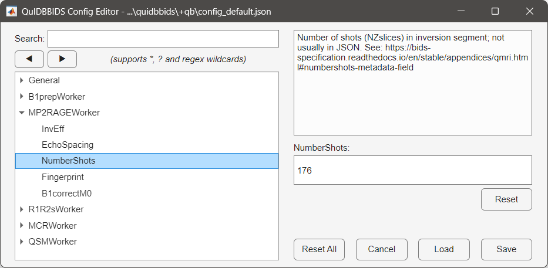

Graphical User Interface
========================

The main window
~~~~~~~~~~~~~~~
In a later release, QuIDBBIDS will provide a main graphical user interface (GUI) for users that prefer an interactive
approach to workflow configuration and execution. The main GUI will allow users to easily select input data, specify
desired outputs, and monitor workflow progress.

In the current release, the main window is not available so we have to initialize the QuIDBBIDS coordinator from 
MATLAB's command window:

.. code-block:: matlab

   >> quidb = qb.QuIDBBIDS('/path/to/bids/dataset');        % Initialize QuIDBBIDS coordinator
   >> quidb.products = ["R1map", "R2starmap", "MWFmap"];    % Specify the output items

After that, as described below, two GUIs can be used.

Processing settings and options
~~~~~~~~~~~~~~~~~~~~~~~~~~~~~~~
All configuration settings and options for processing the data can be set per worker with a GUI, which can be 
launched by either calling the ``editconfig()`` method from your ``QuIDBBIDS`` object, or by directly calling the 
``configeditor()`` function:

.. code-block:: matlab

   >> quidb.editconfig()   % Opens a GUI to edit the settings of your dataset
   >> qb.configeditor()    % Opens a GUI to edit the settings of any dataset

   Left panel: The General QuIDBBIDS settings as well as the the settings for the individual workers. In this
   example the user navigated to the ``MP2RAGEWorker`` and selected the ``NumerShots`` parameter. Right panel:
   The description of the selected parameter (top) with a box to edit its current value of ``176`` (bottom).
