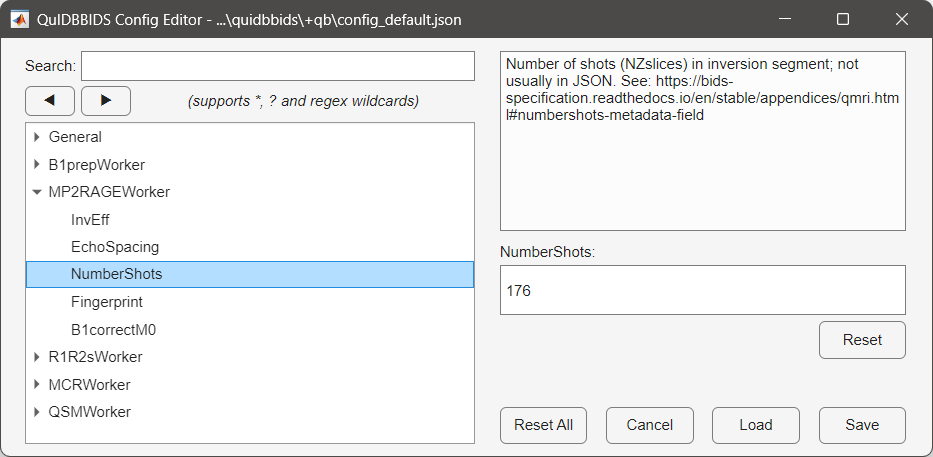

Graphical User Interface
========================

The main window
---------------
In a later release, QuIDBBIDS will provide a main graphical user interface (GUI) for users that prefer an interactive
approach to workflow configuration and execution. The main GUI will allow users to easily select input data, specify
desired outputs, and monitor workflow progress.

In the current release, the main window is not available so we have to initialize the QuIDBBIDS coordinator from 
MATLAB's command window:

.. code-block:: matlab

   >> quidb = qb.QuIDBBIDS();    % Select you BIDS folder to initializes QuIDBBIDS coordinator
   >> quidb.set_deliverables()   % Opens a GUI to specify your output items (e.g. ``R1map`` and ``MWFmap``)

After that, as described below, two GUIs can be used.

Processing settings and options
-------------------------------
All configuration settings and options for processing the data can be set per worker with a GUI, which can be 
launched by either calling the ``editconfig()`` method from your ``QuIDBBIDS`` object, or by directly calling the 
``configeditor()`` function:

.. code-block:: matlab

   >> quidb.editconfig()   % Opens a GUI to edit the settings of your dataset
   >> qb.configeditor()    % Opens a GUI to edit the settings of any dataset

   Left panel: The General QuIDBBIDS settings as well as the the settings for the individual workers. In this
   example the user navigated to the ``MP2RAGEWorker`` and selected the ``NumberShots`` parameter. Right panel:
   The description of the selected parameter (top) with a box to edit its current value of ``176`` (bottom).

General settings
~~~~~~~~~~~~~~~~
The settings in ``General`` apply to all Workers and workflow in general. Here you can add your settings to use
any parallel compute resources, for instance whether or how to use your HPC cluster or GPU. A few settings are of 
particular interest:

   * ``tag``. A custom tag that is added to the deliverables, e.g. to distinguish or compare the results when using
     different parameter settings. In such use cases, you could iteratively: (1) update the config parameter(s) and
     output tag, (2) delete or enforce the workitems that need to be re-computed from the work-folder (3) execute the
     workflow. In this way unaffected work-items in the work-folder can be reused, while the deliverables are save
     with different tags in the output-folder.
     
   * ``BIDS`` > ``include``. A selection filter with BIDS entities (subjects, sessions, suffix, etc) for including raw
     BIDS data in the workflow. This allows users to flexibly deal with datasets that may otherwise have conflicts or
     ambiguities, i.e. limit the workflow to a compatible subset of the data.

SEPIA toolbox settings
~~~~~~~~~~~~~~~~~~~~~~
The QuIDBBIDS ``QSMWorker`` uses the SEPIA toolbox for QSM and relaxometry processing, which comes with its own collection
of settings. If a QSMWorker setting represents a SEPIA menu item (i.e., an option that defines a set of SEPIA processing
options rather than just a single setting), QuIDBBIDS launches a minimal native SEPIA GUI, allowing you to adjust the
SEPIA settings in there (see figure below). Settings that are not menu items (e.g., numerical parameters) can be edited
normally.

Run the workflow
----------------

Finally, to run the workflow, initialize the manager and start the workflow:

.. code-block:: matlab

   >> quidb.manager().start_workflow()    % NB: See the CLI section to forcefully re-running (subtrees of) workflows
