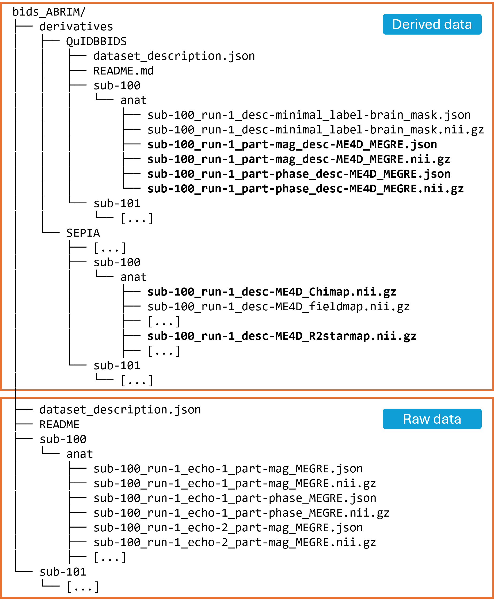
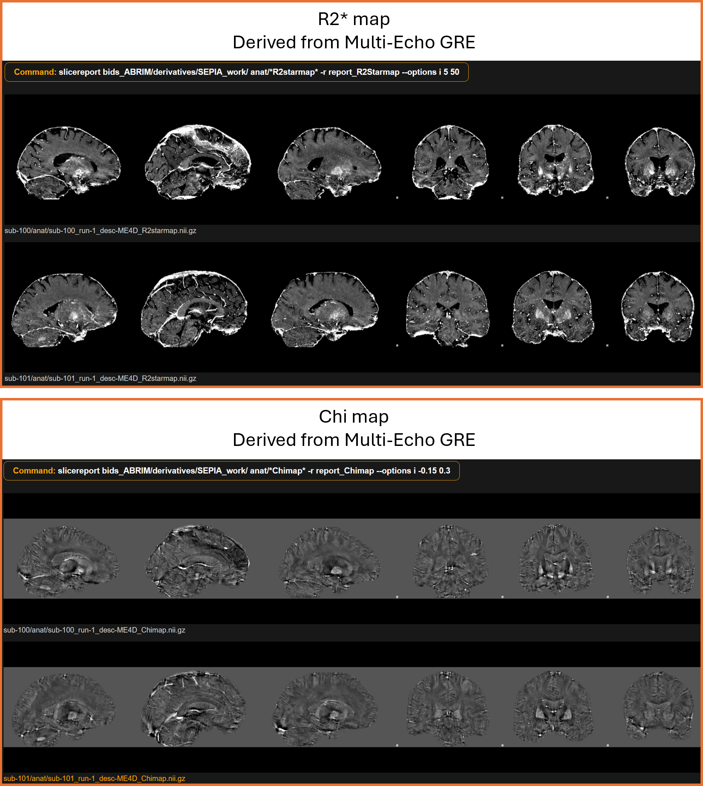

Screenshots
===========

QuIDBBIDS architecture
~~~~~~~~~~~~~~~~~~~~~~

.. figure:: ./_static/workflow_diagram.png
   :width: 90%

   Overview of the QuIDBBIDS workflow. The user specifies the data and desired workitems (``4*`` and ``6*``) 
   to the coordinator. The coordinator inspects the worker pool, interacts with the user to edit settings 
   (algorithm parameters and additional metadata), and activates the manager. The manager puts workers ``1``, 
   ``2``, and ``4`` into a team and directs them to process the input data (“anat” and “fmap”), collaboratively 
   producing workitems ``1–6``. Finally, the manager initiates a controller to verify successful completion.

QuIDBBIDS data
~~~~~~~~~~~~~~

   Example of the raw input (bottom) and the corresponding QuIDBBIDS output data structure (top), showing 
   how file and directory names, data formats, and metadata sidecar files are organized in accordance with the 
   BIDS standard. Boldface filenames indicate work-items that are either needed or produced by the QSMWorker, 
   i.e. input workitems from the “QuIDBBIDS” folder and output items in the “SEPIA” folder.

   R2*- and Chi-maps as computed by QuIDBBIDS from the input data (visualisation made with BIDScoin 
   `slicereport <https://bidscoin.readthedocs.io/en/latest/bidsapps.html#quality-control>`__).
