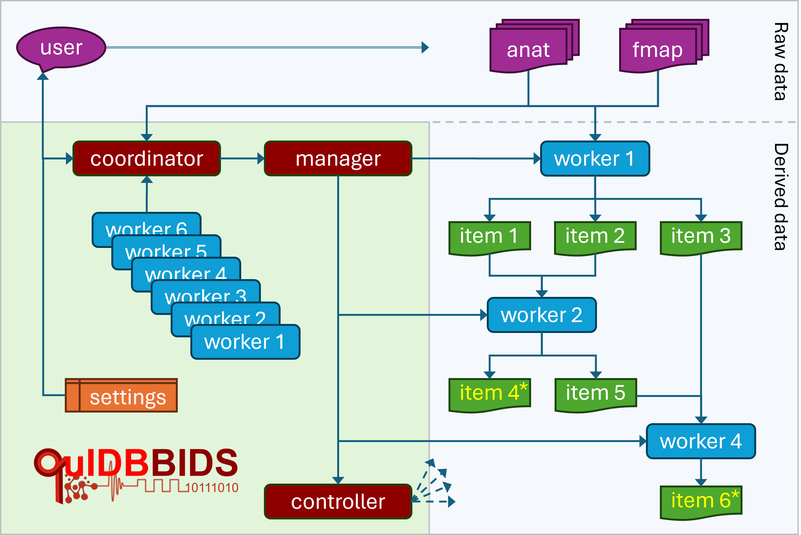

Workflow
========

Inspired by human role-based workflows, QuIDBBIDS defines a hierarchy of specialized modules — Coordinator, 
Manager, Worker, and Controller — designed to minimize workflow and BIDS-related overhead for developers 
implementing new methods in Worker modules, as illustrated below.

   QuIDBBIDS Workflow Architecture. The user specifies the data and desired workitems (``4*`` and ``6*``) 
   to the coordinator. The coordinator inspects the worker pool, interacts with the user to edit settings 
   (algorithm parameters and additional metadata), and activates the manager. The manager puts workers ``1``, 
   ``2``, and ``4`` into a team and directs them to process the input data (“anat” and “fmap”), collaboratively 
   producing workitems ``1–6``. Finally, the manager initiates a controller to verify successful completion.

* **Coordinator module** — The coordinator is named “QuIDBBIDS” and serves as the primary interface with the user, 
  and assists in defining data management and processing options. This centralized coordination enhances the 
  reproducibility and transparency of all executed workflows.

* **Manager module** — Based on the resumes of the Workers and the user’s declared output requests, the manager 
  assembles a “team” of workers that collectively define a workflow — a network of interconnected work-items 
  linking raw inputs to the requested results. The manager then orchestrates workflow execution on a per-subject 
  basis, either sequentially on the local system or in parallel on a high-performance computing (HPC) cluster. 
  Data access is automatically managed via locking and release mechanisms to ensure safe parallel operation. The 
  manager monitors progress, oversees error logs, and directs the Controller to generate comprehensive quality 
  control (QC) reports for all completed tasks.

* **Worker modules** — Each worker represents a modular processing unit and maintains a resume that specifies the
  work-items it requires (for example, a coregistered B1 field map or magnitude and phase GRE data) and the
  work-items it produces (such as an R2* or R1 map). Workers communicate through inherited methods of the base 
  worker module, allowing them to request required work-items from their peers. Upstream workers are triggered 
  recursively when their outputs are needed, and existing items are reused unless forced recomputation is 
  requested. Throughout execution, standardized logs ensure traceability and reproducibility.

The QuIDBBIDS workflow is designed to be modular and flexible, allowing users to easily customize and extend 
the processing workflow.

Command Interface
-----------------
The QuIDBBIDS workflow can be executed directly from the MATLAB command line, scripts or functions. Below is a 
minimal example of how to initialize and run a QuIDBBIDS workflow for all subjects in a BIDS dataset, requesting 
R1, R2*, and MWF maps as output:

.. code-block:: matlab
   :width: 90%

   quidb = qb.QuIDBBIDS('/path/to/bids/dataset')            % Initialize QuIDBBIDS coordinator
   mgr   = quidb.manager(["R1map", "R2starmap", "MWFmap"])  % Create manager for requested output items
   mgr.start_workflow()                                     % Start the workflow

For getting more help on the various classes, methods and properties, you can use MATLAB's built-in documentation 
browser:

.. code-block:: matlab

   doc qb.QuIDBBIDS

Graphical User Interface
------------------------
In the future, QuIDBBIDS will also provide a graphical user interface (GUI) for users who prefer an interactive 
approach to workflow configuration and execution. The GUI will allow users to easily select input data, specify 
desired outputs, and monitor workflow progress through a user-friendly interface.
